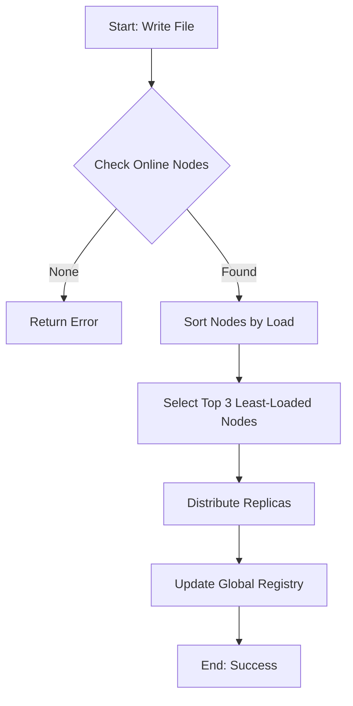

# Project Report: Distributed File System with Load-Aware Routing

## 1. Introduction
*   **Project Title:** Distributed File System with Load-Aware Routing & Fault Tolerance
*   **Student Name(s):** Sathwika Mattipelli
*   **Roll Number(s):** R324ESA19

---

## 2. Project Overview
### Problem Statement
In traditional computing systems, data stored on a single server is highly vulnerable. If the server hardware fails or the network connection drops, the data becomes inaccessible. A Distributed File System (DFS) solves this by spreading data across multiple independent nodes so that no single failure can cause data loss.

### Objectives
*   **Multi-Node Storage:** Implement a network simulation of 5 independent storage nodes in C.
*   **3-Factor Replication:** Ensure every file is duplicated across at least three nodes for high availability.
*   **Load-Aware Routing:** Develop an algorithm that intelligently picks the least-busy servers to store data, preventing node overload.
*   **Automated Fault Recovery:** Create a heartbeat system that detects crashes and automatically rebuilds missing data.
*   **Real-Time Visualization:** Build a web-based dashboard to monitor system health and storage performance.

---

## 3. Module-Wise Breakdown
The system is divided into three core modules:

*   **Module 1: Node Manager**
    *   Keeps track of all the nodes in the network (N1 to N5).
    *   Allows the user to manually crash or recover specific nodes for testing.
    *   Maintains the real-time status (online/offline) and storage load of each node.

*   **Module 2: Replication Engine & Load Balancer**
    *   Handles writing and reading files to the network.
    *   **Load-Aware Routing:** Before saving a file, the system calculates the current disk load of all active servers and routes data to the nodes with the most free space.
    *   Uses a Replication Factor of 3 (RF=3) to ensure data safety.

*   **Module 3: Fault Tolerance & Quorum Management**
    *   **Quorum Monitoring:** Implements a consensus check where the system requires >50% of nodes to be healthy to perform operations (Majority Quorum).
    *   **Network Partition Simulation:** A button that simulates a physical network split, testing how the system handles a loss of quorum.
    *   **Self-Healing:** Automated rebuilds of lost replicas.

*   **Module 4: Distributed Consistency (Advanced)**
    *   **Consistency Mode Toggle:** Allows switching between **Strong Consistency** (high safety) and **Eventual Consistency** (high performance) to demonstrate core distributed systems trade-offs.

---

## 4. System Flow Diagram
Below is the logical flow of a file write operation in the system:



---

## 5. Demonstration (Live Working)
The system operates through a dual-interface:
1.  **C Backend Console:** Handles the heavy lifting of memory management, file sharding, and node status monitoring.
2.  **Web Dashboard:** Provides a real-time "Datacenter Rack" view with 5 server blades. It features physical disk capacity bars and animations of data packets being routed through the network.

---

## 5. Explanation (Methodology & Technology)
### Methodology
We used a modular architecture to separate the storage logic from the visualization. The C backend serves as the authoritative source of truth, while the JavaScript frontend simulates the datacenter environment based on the same scheduling and fault-tolerance algorithms.

### Tools & Technologies
*   **Languages:** C (Backend logic), HTML5/CSS3 (UI), JavaScript (Frontend Logic).
*   **Compiler:** GCC (MinGW).
*   **Version Control:** Git & GitHub (maintained multiple revisions and branches).
*   **Web Server:** Python `http.server`.

---

## 6. Results & Revision Tracking
*   **Observations:** The system successfully handled simultaneous failures of up to 2 nodes. The load-balancing algorithm ensured that files were distributed evenly across the rack, preventing storage bottlenecks.
*   **Revision Tracking:** 
    *   **Repository Name:** Os_Project
    *   **GitHub Link:** https://github.com/sathwika-2200/Os_Project

---

## 7. Conclusion and Future Scope
**Conclusion:**
This project successfully demonstrates how a distributed file system works. By combining a C backend with a web interface, we were able to test and visualize how replication and fault tolerance keep data safe.

**Future Scope:**
*   Implement actual network sockets (TCP/IP) for communication between physical PCs.
*   Add cryptographic sharding for data security.

---

# Appendix

## A. AI-Guided Development Report
The project followed an AI-guided development workflow as per the rubric. AI was used to design the 3-module architecture, optimize the C array handling, and generate the CSS for the Datacenter Rack visualization.

## B. Solution/Code
*(Note: Full code is in the GitHub repository. Below is the Load-Aware Routing logic).*

```c
// Sorting logic for Load-Aware Routing
for (int i = 0; i < online_count - 1; i++) {
    for (int j = i + 1; j < online_count; j++) {
        if (online_nodes[i]->file_count > online_nodes[j]->file_count) {
            Node *temp = online_nodes[i];
            online_nodes[i] = online_nodes[j];
            online_nodes[j] = temp;
        }
    }
}
```
