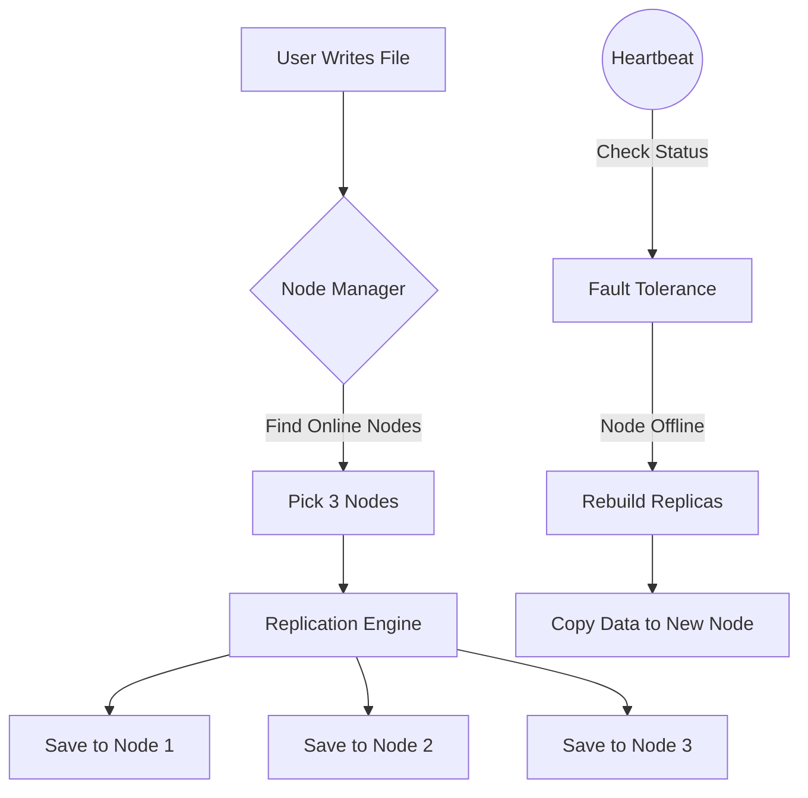

# Project Report: Distributed File System

## 1. Project Overview
This project is a simulation of a Distributed File System (DFS) built to show how data can be stored safely across multiple nodes. In real-world systems, a single server can crash and lose data. To fix this, this project splits data across different nodes using a replication factor of 3. It also includes a heartbeat checker to monitor if nodes go offline and a recovery function to copy lost files to new nodes.

## 2. Module-Wise Breakdown
The system is divided into three main parts:

*   **Module 1: Node Manager**
    *   Keeps track of all the nodes in the network (N1 to N5).
    *   Lets the user manually crash or recover specific nodes for testing.
    *   Stores the status (online/offline) of each node.

*   **Module 2: Replication Engine**
    *   Handles writing files to the network.
    *   Uses a Replication Factor of 3 (RF=3), meaning every file is saved on three different nodes.
    *   **Load-Aware Data Routing:** Before saving a file, the system calculates the current disk load of all active servers and intentionally routes the data to the nodes with the most free space (Load Balancing).
    *   Handles reading files by checking which nodes have the file and picking an online one.

*   **Module 3: Fault Tolerance & Recovery**
    *   Simulates a heartbeat check to see which nodes are alive.
    *   Includes a rebuild function: if a node crashes, it finds files that now have less than 3 copies and duplicates them to other online nodes.

## 3. Functionalities
*   **Network Setup:** Starts with 5 active nodes.
*   **Write/Read Files:** Users can save files to the network and retrieve them.
*   **Crash Testing:** Users can simulate node crashes or whole network failures.
*   **Rebuild:** Automatically restores missing file replicas after a crash.
*   **Web Dashboard:** A local HTML/JS webpage that connects to the simulation to show a visual representation of the server rack and node status.

## 4. Technology Used
*   **Programming Languages:** 
    *   C (Backend logic and file system arrays)
    *   HTML, CSS, JavaScript (Frontend UI)
*   **Libraries and Tools:** 
    *   Standard C Library (`stdio.h`, `stdlib.h`, `string.h`)
    *   GCC Compiler
    *   Python (Used `http.server` to host the dashboard)
*   **Other Tools:** 
    *   GitHub for version control

## 5. Flow Diagram



## 6. Revision Tracking on GitHub
*   **Repository Name:** Os_Project
*   **GitHub Link:** https://github.com/sathwika-2200/Os_Project

## 7. Conclusion and Future Scope
**Conclusion:**
This project successfully demonstrates how a distributed file system works. By combining a C backend with a web interface, we were able to test and visualize how replication and fault tolerance keep data safe even when servers fail.

**Future Scope:**
*   Add file encryption before saving data to the nodes.
*   Allow the user to change the replication factor dynamically instead of keeping it hardcoded at 3.
*   Implement actual network sockets (TCP/IP) instead of a local simulation.

## 8. References
1. Operating System Concepts (Silberschatz, Galvin, Gagne).
2. GitHub Git workflow documentation.
3. MDN Web Docs for frontend JavaScript arrays.

---

# Appendix

## A. AI-Generated Project Elaboration/Breakdown Report
The AI was used to help structure the C code and the web interface. 
1. **Structuring:** Helped split the C code into multiple files (`node_manager.c`, `replication.c`, `fault_tolerance.c`) and create the header file (`dfs.h`).
2. **Logic:** Assisted in writing the array logic for the 3-factor replication so files wouldn't be saved on the same node twice.
3. **Frontend:** Generated the HTML and CSS for the server rack visualization, including the flexbox layout and the light mode theme.

## B. Problem Statement
Design a distributed file system that can handle node failures without losing data. The system needs to replicate files across multiple servers and be able to rebuild lost data if a server goes offline.

## C. Solution/Code
*(Note: Full code is in the GitHub repository. Below is the main replication function).*

```c
// Snippet from replication.c
void rep_write_file(const char* filename) {
    int active_nodes[MAX_NODES];
    int active_count = 0;
    
    for (int i = 0; i < MAX_NODES; i++) {
        if (nodes[i].is_online) {
            active_nodes[active_count++] = i;
        }
    }
    
    if (active_count == 0) {
        printf("Error: No nodes online.\n");
        return;
    }

    int targets = (active_count < REPLICATION_FACTOR) ? active_count : REPLICATION_FACTOR;
    
    // Save file to the targeted nodes
    for (int i = 0; i < targets; i++) {
        int node_id = active_nodes[i];
        nodes[node_id].stored_files[nodes[node_id].file_count++] = strdup(filename);
    }
}
```
